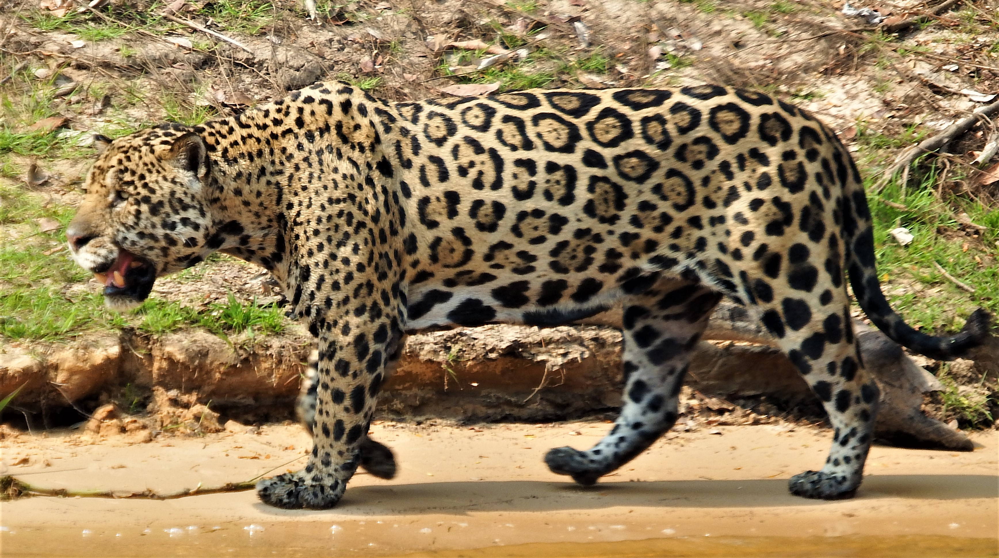

# Panthera

Panthera is a genus within the family Felidae, and one of two extant genera in the subfamily Pantherinae. It contains the largest living members of the cat family. There are five living species: the jaguar, leopard, lion, snow leopard and tiger. Numerous extinct species are also named, including the cave lion and American lion.
